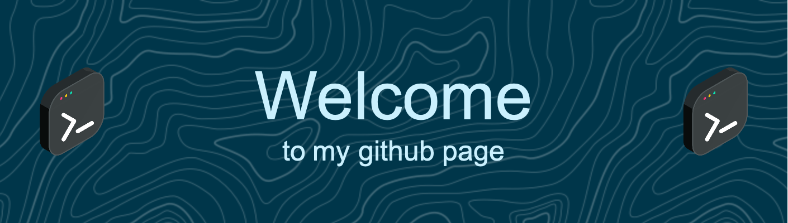

<h1 align="center">Hi 👋, I'm Artem</h1>
<h3 align="center">18 y.o. student</h3>

<link rel="stylesheet" type="text/css" href="styles.css">

<h3 align="left">Languages and Tools:</h3>

            

    

    

    

